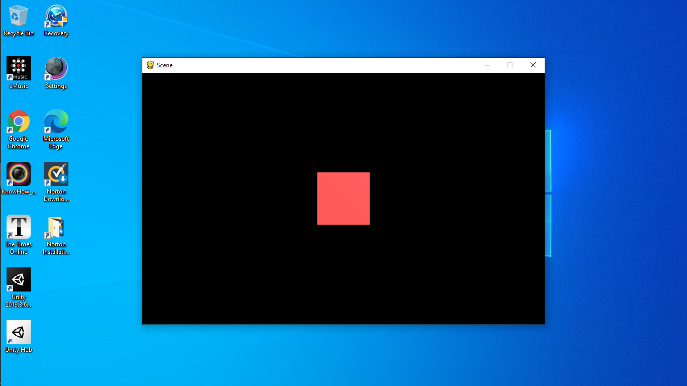
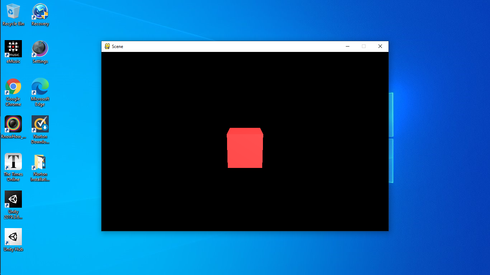

===============================
Tutorial 2: Rendering in Scenes
===============================

Last tutorial we covered some basic concepts
on GameObjects and Transforms, and this time
we'll be looking at how to render things in
a window.

Scenes
======
A Scene is like a page to draw on: you can
add things, remove things and change things.
To create a scene, you can call
``SceneManager.AddScene``:

   >>> scene = SceneManager.AddScene("Scene")

In your newly created scene, you have 2 GameObjects:
a Main Camera, and a Light. These two things can be
moved around like normal GameObjects.

Next, let's move the camera back 10 units:

   >>> scene.mainCamera.transform.localPosition = Vector3(0, 0, -10)

``scene.mainCamera`` references the Camera Component
on the Main Camera, so we can access the Transform
by using its ``transform`` attribute.

Meshes
======
To render anything, we need a model of it. Let's say
we want to create a cube. Then we need a model of a
cube, or what's called a mesh. Meshes have 4 pieces
of data: the vertices (or points), the faces, the
normals and the texture coordinates. Normals are
just vectors saying which way the face is pointing,
and texture coordinates are coordinates to represent
how an image is displayed on the surface of a mesh.

For a simple object like a cube, we don't need to
create our own mesh. Fortunately there is a method
called ``Mesh.cube`` which creates a cube for us.
Here it is:

   >>> cubeMesh = Mesh.cube(2)

The ``2`` means to create a cube with side lengths of
2. Then, to render this mesh, we need a new Component.

The MeshRenderer
================
The MeshRenderer is a Component that can render a mesh
in the scene. To add a new Component, we can use
a method called ``AddComponent``:

   >>> cube = GameObject("cube")
   >>> renderer = cube.AddComponent(MeshRenderer)

Now we can give our renderer the cube mesh from before.

   >>> renderer.mesh = cubeMesh

Finally, we need a Material to use. To create a Material,
we need to specify a colour in RGB.

   >>> renderer.mat = Material(Color(255, 0, 0))

Here I used a red material. Finally we need to add the cube
to our scene, otherwise we can't see it in the window:

   >>> scene.Add(cube)

The full code:

   >>> from pyunity import *
   Loaded config
   Trying GLFW as a window provider
   GLFW doesn't work, trying PySDL2
   Trying PySDL2 as a window provider
   Using window provider PySDL2
   Loaded PyUnity version 0.4.0
   >>> scene = SceneManager.AddScene("Scene")
   >>> scene.mainCamera.transform.localPosition = Vector3(0, 0, -10)
   >>> cubeMesh = Mesh.cube(2)
   >>> cube = GameObject("Cube")
   >>> renderer = cube.AddComponent(MeshRenderer)
   >>> renderer.mesh = cubeMesh
   >>> renderer.mat = Material(Color(255, 0, 0))
   >>> scene.Add(cube)

Then, to run our scene, we use ``scene.Run()``. And now we have
a cube:

To see it better, let's move the camera up a bit and tilt it
downwards. Replace the third line with this:

   >>> scene.mainCamera.transform.localPosition = Vector3(0, 3, -10)
   >>> scene.mainCamera.transform.localEulerAngles = Vector3(15, 0, 0)

Now we can see it better:

Let's say we want to place an image onto the cube. To do this,
we need to change the Material and add a Texture.

   >>> renderer.mat = Material(Color(255, 255, 255), Texture2D("python.png"))

Place ``python.png`` in the same folder as your script and run
the code. Here is the image for reference:

.. image:: _static/python.png

And here is the complete code:

.. code-block:: python

   from pyunity import *
   scene = SceneManager.AddScene("Scene")
   scene.mainCamera.transform.localPosition = Vector3(0, 0, -10)
   cubeMesh = Mesh.cube(2)
   cube = GameObject("Cube")
   renderer = cube.AddComponent(MeshRenderer)
   renderer.mesh = cubeMesh
   renderer.mat = Material(Color(255, 0, 0), Texture2D("python.png"))
   scene.Add(cube)
   scene.Run()

Debugging
=========
If you want to see what you've done already, then you can use
a number of debugging methods. The first is to call ``scene.List()``:

   >>> scene.List()
   /Main Camera
   /Light
   /Cube

This lists all the Gameobjects in the scene. Then, let's check
the cube's components:

   >>> cube.components
   [<Transform position=Vector3(0, 0, 0) rotation=Quaternion(1, 0, 0, 0) scale=Vector3(1, 1, 1) path="/Cube">, <pyunity.core.MeshRenderer object at 0x0B170CA0>]

Finally, let's check the Main Camera's transform.

   >>> scene.mainCamera.transform
   <Transform position=Vector3(0, 3, -10) rotation=Quaternion(0.9914448613738104, 0.13052619222005157, 0.0, 0.0) scale=Vector3(1, 1, 1) path="/Main Camera">

Next tutorial, we'll be covering scripts and Behaviours.