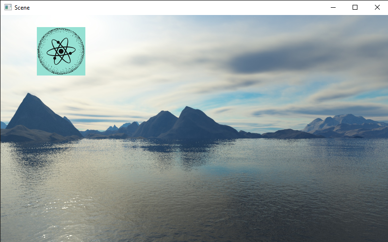

==============
Tutorial 4: 2D
==============

.. contents:: Table of Contents
   :depth: 2
   :local:

This tutorial we will be introducing many
new components, namely the ``RectTransform``
and the ``Image2D``. There is more to
2D than this, but most of the tutorial is quite
dense in new ideas.

Data types
==========
To facilitate positioning objects, we are
going to use ``RectAnchors`` and
``RectOffset``. They both subclass
``RectData``, which means they have two
properties: ``min`` and ``max``. They are both of
type ``Vector2``. For now, let's ignore the
``RectAnchors``.

RectOffset
----------
By ignoring ``RectAnchors`` we can simplify
our offset to a literal rectangle. The ``min`` value
specifies the top left corner of the rectangle, and
the ``max`` value specifies the bottom right corner.
In PyUnity, the X axis goes left to right and the Y
axis goes top to bottom.

For example, a rect that is 100 pixels by 150 pixels,
with a top left corner of (50, 75) would be like this:

   >>> offset = RectOffset(
   ...     Vector2(50, 75),
   ...     Vector2(150, 225) # 100 + 50 and 150 + 75
   ... )

RectTransform
-------------
A ``RectTransform`` has 5 notable properties:
``parent``, ``anchors``, ``offset``, ``rotation``
and ``pivot``. ``parent`` is a read-only property,
which gets the ``RectTransform`` of its parent,
if it has one. ``rotation`` is a
float measured in degrees, and ``pivot`` is
a point between (0.0, 0.0) and (1.0, 1.0) which
defines the rotation point.

Image2D
-------
A ``RectTransform`` can't really do much on its own,
so we'll look at the ``Image2D`` component. This
renders a texture in the rect that is defined from
the ``RectTransform``. If you read tutorial 2, you
may have used the ``Texture2D`` class. Here we can
do the exact same:

   >>> gameObject = GameObject("Image")
   >>> transform = gameObject.AddComponent(RectTransform)
   >>> transform.offset = RectOffset.Rectangle(
   ...     Vector2(100, 100), center=Vector2(125, 75))
   >>> img = gameObject.AddComponent(Image2D)
   >>> img.texture = Texture2D("python.png")

Canvas
------
All 2D renderers must be a descendant of a ``Canvas``
element, which can customize the rendering of 2D
components. We don't need to worry about that too much,
except that if we were to create an ``Image2D`` we must
make it as a child or descendant of our canvas.

.. code-block:: python

   canvas = GameObject("Canvas")
   canvas.AddComponent(Canvas)
   img = GameObject("Image", canvas)
   # And so on...

Here the second argument to the ``GameObject`` constructor
specifies its parent, which must be a ``GameObject``.

Code
====

.. code-block:: python

   from pyunity import *

   scene = SceneManager.AddScene("Scene")
   canvas = GameObject("Canvas")
   canvas.AddComponent(Canvas)
   scene.Add(canvas)

   gameObject = GameObject("Image", canvas)
   transform = gameObject.AddComponent(RectTransform)
   transform.offset = RectOffset.Rectangle(
       Vector2(100, 100), center=Vector2(125, 75))
   img = gameObject.AddComponent(Image2D)
   img.texture = Texture2D("pyunity.png")
   scene.Add(gameObject)

   SceneManager.LoadScene(scene)

PyUnity image:

This is the result:

Interaction
-----------
The easiest way to create an interactable image
is to use the ``Button`` class. This will trigger
whenever any part of the rect is clicked on. Here
is an example:

.. code-block:: python

   class CallbackReceiver(Component):
       def callback():
           Logger.Log("Clicked")

   # Same canvas and image code as above
   ...
   button = gameObject.AddComponent(Button)
   receiver = gameObject.AddComponent(CallbackReceiver)
   button.callback = Event(receiver.callback)

``Button.callback`` must be an ``Event`` object that
contains a method of a component added to a GameObject.
This is because when saving a PyUnity project, the
Python code itself is not saved. It is also easier to
reference a component and a method name in the saved
scene file.

If you check the docs for the ``Button`` class,
you can see two more attributes: ``state`` and
``button``. This specifies what state and which
button must be pressed for the callback to trigger.

If you would like more control over the button,
using a Behaviour is easier as it can interact easily
with other GameObjects and is created on a per-component
basis. However, if you would like more interaction
with the mouse, here is a method:

.. code-block:: python

   class HoverUpdater(Behaviour, GuiComponent):
       def HoverUpdate(self):
           Logger.Log("Hovering over component")

   # Same canvas and image code as above
   ...
   gameObject.AddComponent(HoverUpdater)

The ``GuiComponent`` class defines an abstract method
called ``HoverUpdate`` which is called whenever the mouse
is hovering over a component. This method will be called
exactly once per canvas in a single GuiComponent each frame.
In fact, this is how the ``Button`` class is implemented.

Anchors
=======
For a 2D rect to scale with the window, we can use the
``anchors`` property of the ``RectTransform``. This has
two values like the ``offset``, a ``min`` and a ``max``.
These two values are between ``Vector2(0, 0)`` and
``Vector2(1, 1)``, where 0 and 1 represent the left and
right of the window, or the top and bottom of the window.
The offsets are applied where the anchors are.

The easiest way to understand this is when the anchors are
a single point. For example, the default anchors are
``RectAnchors(Vector2(0, 0), Vector2(0, 0))``. This means
both points of the anchors are at ``Vector2(0, 0)`` so
all offsets are calculated from the top left.

If we wanted our rect to be centered in the middle at all
times, or be offset from the middle, we can set the anchors
to be at ``Vector2(0.5, 0.5)``. Likewise, if we wanted our
rect to be at the bottom right, we can use ``Vector2(1, 1)``.

This applies with two anchors: if we wanted our rect to be 50px
away from each edge of the window, we would use anchors of
``RectAnchors(Vector2(0, 0), Vector2(1, 1))`` and offset of
``RectOffset(Vector2(50, 50), Vector2(-50, -50))``. This is how
we can control the scaling of a rect with respect to the window size.

This tutorial was quite code-heavy, and it is not quite complete.
If you are confused, please join our discord support server at
https://discord.com/zTn48BEbF9.